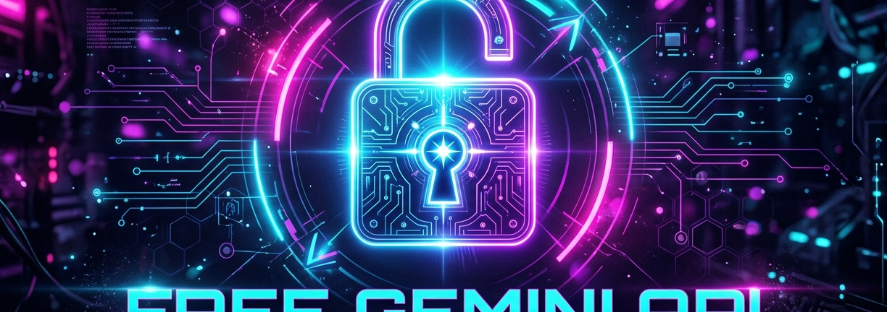

# 🔓 Free Gemini API (Go & WebSocket Session Bridge)

An high-performance, OpenAI-compatible server written in Go that routes text chat, Gemini image generation, music beat synthesis, and Gemini video generation requests directly to Google Gemini's web client. Fully automated session authentication via WebSocket cookie-bridge extension.

---

## ✨ Features

- 💬 **OpenAI Chat Completions Endpoint**: `/v1/chat/completions` (Text chat with SSE streaming support).
- 🎨 **Gemini Image Generation**: Standard `/v1/images/generations` OpenAI-compatible endpoint.
- 🎬 **Gemini Video Generation**: High-quality 2-to-10 second cinematic video outputs.
- 🎵 **Music & Beat Synthesis**: YouTube Lyria-powered high-fidelity lofi audio beats.
- 🔌 **Chrome Cookie-Sync Extension**: Lightweight event-driven browser extension that automatically captures and syncs session cookies over WebSockets (no remote-debugging or custom profiles needed).
- 🤖 **Model Context Protocol (MCP) Server**: Built-in stdio-based MCP wrapper to expose `generate_image`, `generate_video`, `generate_music`, and `chat` directly as native tools inside Claude Desktop, Cursor, or Windsurf.
- ⚡ **Dynamic Host Binding**: Generates media paths dynamically matching the host address of incoming requests (`c.Host()`), making it cloud-ready for Cloudflare Tunnels and Ngrok!

---

## 📸 Sample Output

Below is an actual sample image generated by the API via `/v1/images/generations` with no watermarks and high quality:


---

## 🛠️ Setup & Running

### 1. Configure the Environment
Create a `.env` file in the root directory (based on `.env.example`):
```env
WS_PORT=9226
PORT=8001
```

### 2. Install the Browser Extension
1. Open Google Chrome and go to `chrome://extensions/`.
2. Enable **Developer mode** (top right toggle).
3. Click **Load unpacked** (top left button) and select the `gemini-extension` folder.
4. Open [Gemini Web UI](https://gemini.google.com) and log in. The extension will sync your cookies automatically.

### 3. Launch the Server
Start the Go API server:
```bash
go run main.go
```
The console will display:
```text
📡 Cookie WebSocket Server listening on 127.0.0.1:9226
INFO Server started on: http://127.0.0.1:8001 (port 8001)
```

---

## 🔌 Running the MCP Server (For Cursor/Claude Desktop)

Compile the MCP stdio binary:
```bash
go build -o gemini-mcp mcp_server.go
```

To configure it in **Claude Desktop**, add this to your `claude_desktop_config.json`:
```json
{
  "mcpServers": {
    "free-gemini": {
      "command": "/absolute/path/to/free-gemini-api/gemini-mcp",
      "args": []
    }
  }
}
```

---

## 📝 Running Tests

To verify all endpoints (Text, Image, Music, and Video) work correctly in isolated sessions, run the automated test suite:
```bash
go run test/test.go
```
